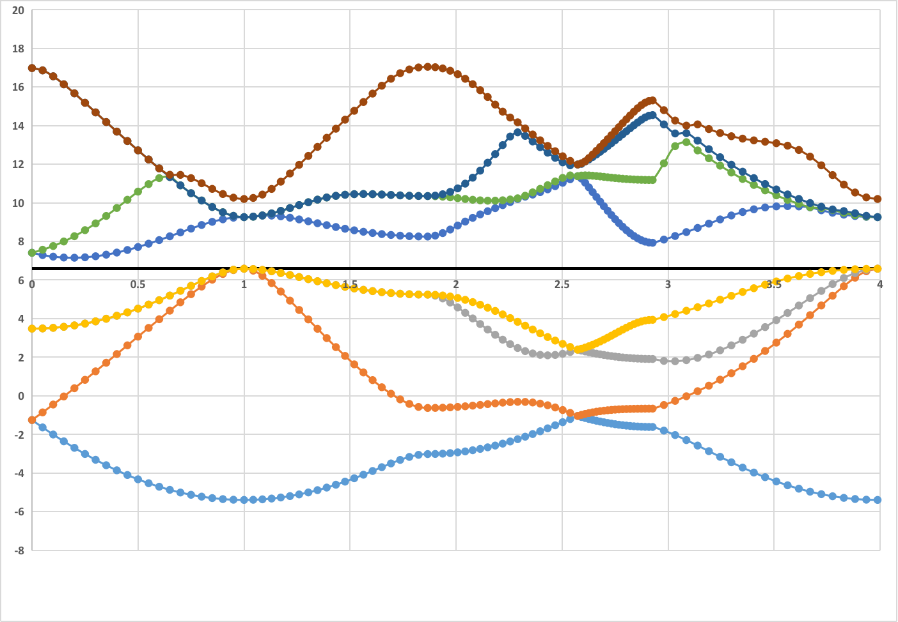

# ABACUS使用指南

**作者: BS**

---

*安装请参看ABACUS安装指南*

## 系统环境
本指南以qlab服务器环境进行编译为例子.

### 服务器加载环境
使用`module load`指令.

``` bash 
module load abacus/intel-3.0.1
```

## 执行ABACUS
ABACUS支持openmp+MPI混合并行.

### 直接运行 (个人电脑)
如果直接运行 
- `OMP_NUM_THREADS`控制openmp使用的线程数; 
- `mpirun -np xx`, `xx`代表`mpi`使用的并行核数.

最后使用的核数=`xx` x `OMP_NUM_THREADS`

比如执行 

``` bash
$ OMP_NUM_THREADS=4; 
$ mpirun -np 2 ABACUS.mpi 
```

将会使用2x4=8个核.

这里提供一个脚本模板`run.sh`
​``` bash
#!/bin/bash

ABACUS_PATH=$ABACUSROOT/bin/ABACUS.mpi
ABACUS_NPROCS=2
ABACUS_THREADS=4
```

# run abacus

### 使用队列管理系统 (集群)
*这里使用Slurm作为例子*

下面为`Slurm`提交ABACUS的脚本`run.slurm`模板. 

``` bash
#!/bin/bash -l

#|=======================================
#| set output and error file name
#| if not set, slurm will generate files 
#| with name stdout and stderr.
#|---------------------------------------
## #SBATCH -o Slurm-o.%j
## #SBATCH -e Slurm-e.%j

#|=======================================
#| name of the job
#|---------------------------------------
#SBATCH -J abacus

#|=======================================
#| execute job from the current working directory
#| this is default slurm behavior
#|---------------------------------------
#SBATCH -D ./

#|=======================================
#| send mail
#| send when job done
#|---------------------------------------
#+ #SBATCH --mail-type=end
#+ #SBATCH --mail-user=YOUR_NAME@YOUR_MAIL_SERVER

#|=======================================
#| specify your job requires
#|---------------------------------------
#|- set nodes, task, cpus for a hybrid MPI/OpenMP job
#|-
#|- nodes you required
#SBATCH --nodes=1
#|- tasks on each node, it depends on the cluster
#|- use 'sinfo --Node --long' to know how many cores per node
#SBATCH --ntasks-per-node=2
#|- Number of cores per task (for openmp)
#SBATCH --cpus-per-task=4
#|---------------------------------------
#|- set memory limit 4000Mb
#|- #SBATCH --mem 4000
#|---------------------------------------
#|- PARTITION & time limit
#|- use `sinfo` to list PARTITION & TIMELIMIT
#SBATCH -p debug
#|- Quality
#SBATCH -q short
## time format day-hour:minute:second
#SBATCH --time=00-00:30:00

#|=======================================
#| start to set your environment for your job
#|---------------------------------------

#|-+-+-+-+-+-+-+-+-+-+-+-+-+-+-+-+-+-+-+-
#- load intel abacus
#|---------------------------------------
module load abacus/intel-3.0.1

export MKLPATH=$MKL_HOME/lib/intel64/
export LD_LIBRARY_PATH=$LD_LIBRARY_PATH:$MKLPATH
export INTELPATH=$INTEL_HOME/lib/intel64/
export LD_LIBRARY_PATH=$LD_LIBRARY_PATH:$INTELPATH
#+

#|-+-+-+-+-+-+-+-+-+-+-+-+-+-+-+-+-+-+-+-
#- set parallel environment
#|---------------------------------------
#- use mpi/openmp
if [ -n "$SLURM_CPUS_PER_TASK" ]; then
    omp_threads=$SLURM_CPUS_PER_TASK
else
    omp_threads=1
fi
export OMP_NUM_THREADS=$omp_threads
export MKL_NUM_THREADS=$omp_threads

#- If you prefer using mpiexec/mpirun with SLURM, please add the following code to the batch script before running any MPI executable
# unset I_MPI_PMI_LIBRARY 
# export I_MPI_JOB_RESPECT_PROCESS_PLACEMENT=0   # the option -ppn only works if you set this before

#|-+-+-+-+-+-+-+-+-+-+-+-+-+-+-+-+-+-+-+-
#| load your own lib path(if needed)
#|---------------------------------------
#+ export PATH=$PATH:your path

#|=======================================
#| start to run your job
#|---------------------------------------
rm Slurm-*

#|=======================================
# run ABAUCUS HERE
#|---------------------------------------
ABACUS_PATH=$ABACUSROOT/bin/ABACUS.mpi
#|vvvvvvvvvvvvvvvvvvvvvvvvvvvvvvvvvvvvvvv
# srun .....
#|^^^^^^^^^^^^^^^^^^^^^^^^^^^^^^^^^^^^^^^

#|=======================================
#| done
#|---------------------------------------
# exit 0
```
其中`#SBATCH --nodes=1`用来设置要使用几个`node`(节点), 节点和节点之间是MPI并行. 这里用了1个`node`.
`#SBATCH --ntasks-per-node=2`是用来设置每个节点要用几个`task`, `task`之间也是MPI并行. 这里用了2个`task`.
`#SBATCH --cpus-per-task=4`是每个`task`使用多少`CPU`进行OpenMP进行并行. 这里用了4个`cpu`.
*注意*, `ntasks-per-node`x`cpus-per-task`要小于机器上单个节点最大核数. 

在这个例子里, 一共用了`1x2x4=8`个`cpu`. 

通过下面指令, 提交脚本, 运行程序.
``` bash
$ sbatch run.slurm
```
*注意*, 
- 脚本里出现的`#SBATCH -p debug`和`#SBATCH -q short`的`debug`和`short`要和集群管理原确认节点名称后自行修改.
- 要将`# srun .....`替换为最终要执行的指令, 后面的例子会给出具体指令.


### 运行官方例子
ABACUS提供了丰富的例子, 但是例子利用程序的相对路径进行执行, 不太适合在集群上运行.
所以下面我们将把例子拷贝出来, 并修改执行脚本.

我们将使用提供的`Si`的例子来说明修改方法.

- 准备文件

```bash
$ ls -al $ABACUSROOT/examples/band/lcao_Si2
total 32
drwxrwxr-x 2 xxxx xxxx 4096 Xxx xx xx:xx .
drwxrwxr-x 4 xxxx xxxx 4096 Xxx xx xx:xx ..
-rw-rw-r-- 1 xxxx xxxx  546 Xxx xx xx:xx INPUT1
-rw-rw-r-- 1 xxxx xxxx  444 Xxx xx xx:xx INPUT2
-rw-rw-r-- 1 xxxx xxxx  112 Xxx xx xx:xx KLINES
-rw-rw-r-- 1 xxxx xxxx   29 Xxx xx xx:xx KPT
-rw-rw-r-- 1 xxxx xxxx  462 Xxx xx xx:xx run.sh
-rw-rw-r-- 1 xxxx xxxx  348 Xxx xx xx:xx STRU

```

## Example
ABACUS提供了丰富的例子, 但是例子利用程序的相对路径进行执行, 不太适合在集群上运行.
所以下面我们将把例子拷贝出来, 并修改执行脚本.

为了方便执行下面的例子, 请查看本地是否有`$ABACUSROOT`, 如果没有请设置`$ABACUSROOT`为ABACUS源码的跟目录.

``` bash
# 输出, 如果有输出那就是有设置
$ echo $ABACUSROOT;
/xx/xx/abacus/3.0.1
# 没有的话需要自行设置, 或者用module load abacus
$ ABACUSROOT=xx/xx/abacus-develop
$ ls $ABACUSROOT
bin  CMakeLists.txt  conda  Dockerfile  Dockerfile.cuda  Dockerfile.gnu  Dockerfile.intel  docs  examples  LICENSE  modules  README.md  source  tests  tools
```

### Band:lcao_Si2

**官方解释:**
`$ABACUSROOT/examples/band/README`

These examples show how to calculate the bands structures.
It requires two steps of calculation:
1. Do the scf calculation and output the information of charge:
   - set 'calculation' to 'scf'
   - set 'out_chg' to '1'
2. Do the nscf calculation and output the information of band:
   - set 'calculation' to 'nscf'
   - set 'init_chg' to 'file'
   - set 'out_band' to '1'
   - set 'pw_diag_thr' to a suitable value when basis_type is 'pw'
Generally, in step 2, the KPT file has the 'LINE' mode (an example is lcao_Si2/KLINES)
to calculate a series of specified k points.  

Finish! Then you can see BANDS_1.dat in OUT.ABACUS. Plot it!

#### 运行

- 复制官方输入
  
    ``` bash
    # 切换到项目主目录
    $ cd DFTkit-learn/ABACUS/;
    # 创建目录
    $ mkdir -p ./run_example/band;
    # 删除例子
    $ rm -rf ./run_example/band/lcao_Si2;
    # 复制
    $ cp -r $ABACUSROOT/examples/band/lcao_Si2 ./run_example/band/;
    # 切换到目录下
    $ cd ./run_example/band/;
    $ ls -al
    drwxrwxr-x 2 xxx xxx 4096 Xxx xx xx:xx .
    drwxrwxr-x 3 xxx xxx 4096 Xxx xx xx:xx ..
    -rw-rw-r-- 1 xxx xxx  546 Xxx xx xx:xx INPUT1
    -rw-rw-r-- 1 xxx xxx  444 Xxx xx xx:xx INPUT2
    -rw-rw-r-- 1 xxx xxx  112 Xxx xx xx:xx KLINES
    -rw-rw-r-- 1 xxx xxx   29 Xxx xx xx:xx KPT
    -rw-rw-r-- 1 xxx xxx  462 Xxx xx xx:xx run.sh
    -rw-rw-r-- 1 xxx xxx  348 Xxx xx xx:xx STRU
    ```

- 修改INPUT文件的相对路径
    ``` bash
    $ sed -i "s|../../..|$ABACUSROOT|g" INPUT1
    $ sed -i "s|../../..|$ABACUSROOT|g" INPUT2
    ```

- (个人电脑) 将前文提到的`run.sh`模板复制过来, 并把脚本中`# run abacus`替换为:
  
    ``` bash
    cp INPUT1 INPUT
    OMP_NUM_THREADS=${ABACUS_THREADS} mpirun -np ${ABACUS_NPROCS} ${ABACUS_PATH} | tee scf.output
    cp INPUT2 INPUT
    OMP_NUM_THREADS=${ABACUS_THREADS} mpirun -np ${ABACUS_NPROCS} ${ABACUS_PATH} | tee nscf.output

    rm INPUT
    ```  

    运行
    ``` bash
    $ ./run.sh
    ```

- (集群) 将前文提到的`run.slurm`模板复制过来, 并把脚本中`# srun .....`替换为

    ``` bash
    cp INPUT1 INPUT
    srun ${ABACUS_PATH} > scf.output
    cp INPUT2 INPUT
    srun ${ABACUS_PATH} > nscf.output

    rm INPUT
    ```

    运行
    ``` bash
    $ sbatch run.slurm
    ```

#### 结果分析
- 程序一共运行了两次, 第一次是对系统进行DFT自洽迭代计算基态信息(密度, 能量等)
- 第二次运行, 根据`KLINES`提供的`k`路径计算能带, 并把每条路径上的能带输入到`OUT.ABACUS/BANDS_1.dat`中.
  
在`OUT.ABACUS/running_scf.log`中可以找到费米能的信息:`EFERMI = 6.585653952033698 eV`.

`KLINES`一共提供了6个k点, 每两个k点形成一条路径.
比如前两个k点:
``` text
Line
0.5 0.0 0.5 20
0.0 0.0 0.0 20
```
代表从`0.5 0.0 0.5` $\to$ `0.0 0.0 0.0`这条路径选取20个点.

`INPUT2`中`nbands 8`代表输出8个能带数目.

`OUT.ABACUS/BANDS_1.dat`储存格式为:

"k标号 某种坐标投影 能量1 能量2 ... 能量x" 

` x为`nbands`设置的数量.

将`BANDS_1.dat`放到画图软件里就可以得到能带.



从图里可以得到计算的能带为`7.155004-6.585653952033698=0.5693500479663021 eV`, 实验值能带为`1.17 eV`. 

在`INPUT1`中没有指定exchange-correlation functional, 程序默认使用的是`PERDEW-ZUNGER (LDA)`返泛函. 因为自作用误差的原因(self-interaction error), 该泛函计算出的能隙会低于实验值.


  
