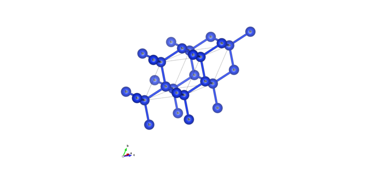

# lcao_Si2

| 创建     | bsplu | 2022.11.25 |
|----------|-------|------------|
| 最后修改 | bsplu | 2022.12.06 |

**简介**: 用`lcao`基组计算Si2的能带. 
**官方路径**: `$ABACUSROOT/examples/band/lcao_Si2`
**本讲解路径**: `DFTkit-learn/ABACUS/example_ref/band/lcao_Si2`

---

## 官方解释:
所在路径: `$ABACUSROOT/examples/band/README`

These examples show how to calculate the bands structures.
It requires two steps of calculation:
1. Do the scf calculation and output the information of charge:
   - set 'calculation' to 'scf'
   - set 'out_chg' to '1'
2. Do the nscf calculation and output the information of band:
   - set 'calculation' to 'nscf'
   - set 'init_chg' to 'file'
   - set 'out_band' to '1'
   - set 'pw_diag_thr' to a suitable value when basis_type is 'pw'
Generally, in step 2, the KPT file has the 'LINE' mode (an example is lcao_Si2/KLINES)
to calculate a series of specified k points.  

Finish! Then you can see BANDS_1.dat in OUT.ABACUS. Plot it!

## 运行 (讲解)

- 复制官方输入
  
    ``` bash
    # 切换到项目主目录
    $ cd DFTkit-learn路径/ABACUS/;
    # 创建目录
    $ mkdir -p ./run_example/band;
    # 删除例子
    $ rm -rf ./run_example/band/lcao_Si2;
    # 复制
    $ cp -r $ABACUSROOT/examples/band/lcao_Si2 ./run_example/band/;
    # 切换到目录下
    $ cd ./run_example/band/lcao_Si2;
    $ ls -al
    drwxrwxr-x 2 xxx xxx 4096 Xxx xx xx:xx .
    drwxrwxr-x 3 xxx xxx 4096 Xxx xx xx:xx ..
    -rw-rw-r-- 1 xxx xxx  546 Xxx xx xx:xx INPUT1
    -rw-rw-r-- 1 xxx xxx  444 Xxx xx xx:xx INPUT2
    -rw-rw-r-- 1 xxx xxx  112 Xxx xx xx:xx KLINES
    -rw-rw-r-- 1 xxx xxx   29 Xxx xx xx:xx KPT
    -rw-rw-r-- 1 xxx xxx  462 Xxx xx xx:xx run.sh
    -rw-rw-r-- 1 xxx xxx  348 Xxx xx xx:xx STRU
    ```

- 修改INPUT文件的相对路径
    ``` bash
    $ sed -i "s|../../..|$ABACUSROOT|g" INPUT1
    $ sed -i "s|../../..|$ABACUSROOT|g" INPUT2
    ```

- (个人电脑) 将前文提到的`run.sh`模板复制过来, 并把脚本中`# run abacus`替换为:
  
    ``` bash
    cp INPUT1 INPUT
    OMP_NUM_THREADS=${ABACUS_THREADS} mpirun -np ${ABACUS_NPROCS} ${ABACUS_PATH} | tee scf.output
    cp INPUT2 INPUT
    OMP_NUM_THREADS=${ABACUS_THREADS} mpirun -np ${ABACUS_NPROCS} ${ABACUS_PATH} | tee nscf.output

    rm INPUT
    ```  

    运行
    ``` bash
    $ ./run.sh
    ```

- (在集群)运行 
    - 复制提交脚本.
        ``` bash
        $ cp DFTkit-learn路径/src/run_abacus.slurm run.slurm
        ```
  
    - 用文本编辑器打开`run.slurm`, 并把脚本中`# srun .....`的内容替换为
        ``` bash
        cp INPUT1 INPUT
        srun ${ABACUS_PATH} > scf.output
        cp INPUT2 INPUT
        srun ${ABACUS_PATH} > nscf.output

        rm INPUT
        ```

    - 运行
        ``` bash
        $ sbatch run.slurm
        ```

## 结果分析
- 程序一共运行了两次, 第一次是对Si2系统进行DFT自洽迭代计算基态信息(密度, 能量等)
  
- 第二次运行, 根据`KLINES`提供的`k`路径计算能带, 并把每条路径上的能带输入到`OUT.ABACUS/BANDS_1.dat`中.
  
  
在`OUT.ABACUS/running_scf.log`中可以找到费米能的信息:`EFERMI = 6.585653952033698 eV`.

`KLINES`一共提供了6个k点, 每两个k点形成一条路径.
比如前两个k点:
``` text
Line
0.5 0.0 0.5 20
0.0 0.0 0.0 20
```
代表从`0.5 0.0 0.5` $\to$ `0.0 0.0 0.0`这条路径选取20个点.

`INPUT2`中`nbands 8`代表输出8个能带数目.

`OUT.ABACUS/BANDS_1.dat`储存格式为:

"k标号 某种坐标投影 能量1 能量2 ... 能量x" 

` x为`nbands`设置的数量.

将`BANDS_1.dat`放到画图软件里就可以得到能带.


从图里可以得到计算的能带为`7.155004-6.585653952033698=0.5693500479663021 eV`, 实验值能带为`1.17 eV`. 

在`INPUT1`中没有指定exchange-correlation functional, 程序默认使用的是`PERDEW-ZUNGER (LDA)`返泛函. 因为自作用误差的原因(self-interaction error), 该泛函计算出的能隙会低于实验值.
