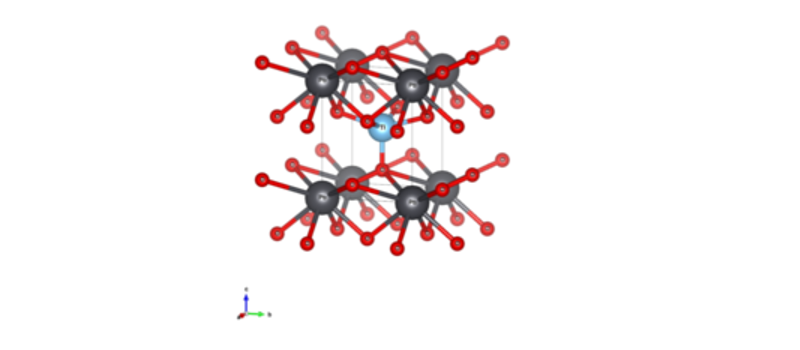

# lcao_PbTiO3

| 创建     | bsplu | 2022.12.06 |
|----------|-------|------------|
| 最后修改 | bsplu | 2022.12.08 |

**简介**: 用`lcao`基组计算PbTiO3的能带. 
**官方路径**: `$ABACUSROOT/examples/berryphase/lcao_PbTiO3`
**本讲解路径**: `DFTkit-learn/ABACUS/example_ref/berryphase/lcao_PbTiO3`

---

## 官方解释(请仔细阅读):
- 例子介绍: `$ABACUSROOT/examples/berryphase/README`
    These examples show how to use Berry phase method.
    It requires two steps of calculation:
    1. Do the scf calculation and output the information of charge:
        - set 'calculation' to 'scf'
        - set 'out_chg' to '1'
    2. Do the nscf calculation:
        - set 'calculation' to 'nscf'
        - set 'init_chg' to 'file'
        - set 'berry_phase' to '1'
        - set 'gdir' to '1' (or '2', or '3')
        - set 'pw_diag_thr' to a suitable value when basis_type is 'pw'

- [>>参数设置与输出文件解释<<](https://abacus.deepmodeling.com/en/latest/advanced/elec_properties/Berry_phase.html)

## 运行 (讲解)

- 复制官方输入
  
    ``` bash
    # 切换到项目主目录
    $ cd DFTkit-learn路径/ABACUS/;
    # 创建目录
    $ mkdir -p ./run_example/berryphase;
    # 删除例子
    $ rm -rf ./run_example/berryphase/lcao_PbTiO3;
    # 复制
    $ cp -r $ABACUSROOT/examples/berryphase/lcao_PbTiO3 ./run_example/berryphase/;
    # 切换到目录下
    $ cd ./run_example/berryphase/lcao_PbTiO3;
    $ ls -al
    total 48
    drwxrwxr-x 2 xxxx xxxx 4096 xxx  xx xx:xx .
    drwxrwxr-x 3 xxxx xxxx 4096 xxx  xx xx:xx ..
    -rw-rw-r-- 1 xxxx xxxx  249 xxx  xx xx:xx INPUT-nscf-a
    -rw-rw-r-- 1 xxxx xxxx  249 xxx  xx xx:xx INPUT-nscf-b
    -rw-rw-r-- 1 xxxx xxxx  249 xxx  xx xx:xx INPUT-nscf-c
    -rw-rw-r-- 1 xxxx xxxx  251 xxx  xx xx:xx INPUT-scf
    -rw-rw-r-- 1 xxxx xxxx   29 xxx  xx xx:xx KPT-nscf-a
    -rw-rw-r-- 1 xxxx xxxx   29 xxx  xx xx:xx KPT-nscf-b
    -rw-rw-r-- 1 xxxx xxxx   29 xxx  xx xx:xx KPT-nscf-c
    -rw-rw-r-- 1 xxxx xxxx   29 xxx  xx xx:xx KPT-scf
    -rw-rw-r-- 1 xxxx xxxx  495 xxx  xx xx:xx run.sh
    -rw-rw-r-- 1 xxxx xxxx  785 xxx  xx xx:xx STRU
    ```

- 修改INPUT文件的相对路径
    ``` bash
    $ for f in INPUT-*; do echo $f; sed -i "s|../../..|$ABACUSROOT|g" $f;  done
    ```

- (个人电脑) 将前文提到的`run.sh`模板复制过来, 并把脚本中`# run abacus`替换为:
  
    ``` bash
    cp INPUT1 INPUT
    OMP_NUM_THREADS=${ABACUS_THREADS} mpirun -np ${ABACUS_NPROCS} ${ABACUS_PATH} | tee scf.output
    cp INPUT2 INPUT
    OMP_NUM_THREADS=${ABACUS_THREADS} mpirun -np ${ABACUS_NPROCS} ${ABACUS_PATH} | tee nscf.output

    rm INPUT
    ```  

    运行
    ``` bash
    $ ./run.sh
    ```

- (在集群)运行 
    - 复制提交脚本.
        ``` bash
        $ cp DFTkit-learn路径/src/run_abacus.slurm run.slurm
        ```
  
    - 以`run.sh`中的内容为参考. 用文本编辑器打开`run.slurm`, 并把脚本中`# srun .....`的内容替换为
        ``` bash
        cp INPUT-scf INPUT
        cp KPT-scf KPT
        srun ${ABACUS_PATH} > scf.output

        cp INPUT-nscf-c INPUT
        cp KPT-nscf-c KPT
        srun ${ABACUS_PATH} > nscf.output
        ```

    - 运行
        ``` bash
        $ sbatch run.slurm
        ```

## 结果分析
- 程序一共运行了两次, 第一次是对系统进行DFT自洽迭代计算基态信息(密度, 能量等). 
- 第二次运行, `INPUT-nscf-c`文件中包含设置`berry_phase             1`. 
    该设置添加后, 程序将利用[Berry phase](https://doi.org/10.1016/j.jssc.2012.05.010)方法, 计算绝缘体`PbTiO3`的极化, 结果输出到`OUT.ABACUS/running_nscf.log`中.
    `INPUT-nscf-c`文件中`gdir                    3`指定了计算沿着`c`轴方向的极化.
    
  
    `OUT.ABACUS/running_nscf.log`部分内容为:

    ```
    >>>>>>>>>>>>>>>>>>>>>>>>>>>>>>>>>>>>>>>>>>>>>>>>>>>>>>>>>>>>>>>>>>>>>>
    |                                                                    |
    | POLARIZATION CALCULATION:                                          |
    |                  Modern Theory of Polarization                     |
    | calculate the Macroscopic polarization of a crystalline insulator  |
    | by using Berry Phase method.                                       |
    |                                                                    |
    <<<<<<<<<<<<<<<<<<<<<<<<<<<<<<<<<<<<<<<<<<<<<<<<<<<<<<<<<<<<<<<<<<<<<<


    VALUES OF POLARIZATION

    The Ionic Phase:   -0.10600
    Electronic Phase:    0.92508

    The calculated polarization direction is in R3 direction

    P =    7.4095195  (mod   18.0922373)  (   0.0000000,   0.0000000,   7.4095195) (e/Omega).bohr

    P =    0.0155792  (mod    0.0380407)  (   0.0000000,   0.0000000,   0.0155792) e/bohr^2

    P =    0.8906925  (mod    2.1748536)  (   0.0000000,   0.0000000,   0.8906925) C/m^2
    ```

`P = xxx`为最终计算结果, 并且提供了三种不同的单位制的值. 这里我们看`C/m^2`单位, 并和实验和其他发表的计算结果对比:

| Polarization                                                    | [C/m2]  |
|-----------------------------------------------------------------|---------|
| ABACUS                                                          | 0.89    |
| [Tadmor et. al.](https://doi.org/10.1016/S1359-6454(02)00127-1) | 0.87    |
| Expt.                                                           | 0.5–1.0 |

用ABACUS和[Tadmor et. al.](https://doi.org/10.1016/S1359-6454(02)00127-1)计算的结果吻合, 说明没有计算错误. 而且和实验值对比的结果也非常好.
虽然在计算Si能带时看到DFT的误差挺大的, 但是在计算极化的时候DFT的精度还是很高的. 原因是(BS猜测)极化主要依赖的是基态密度, 而DFT在常规绝缘体体系的基态密度的还原上表现很好.
