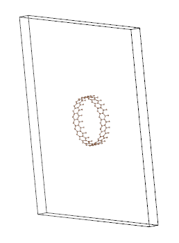

#### 介绍
在该例子里, 我们将使用ABACUS+DeepH完整实现计算C纳米管的计算过程.

碳纳米管一个原胞:


#### 下载

该例子DeepH官方提供了程序来生成数据, 我们需要下载官方提供的配套程序代码.

- 下载链接为DeepH仓库地址 >>>[下载链接](https://github.com/deepmodeling/DeepH-pack/files/9526304/demo_abacus.zip)<<<
  ``` bash
  # 找到DeepH路径
  $ cd DFTkit-learn地址/DeepH;
  # 创建文件夹
  $ mkdir -p run_example/02_abacus_nanotube_Carbon;
  $ cd run_example/02_abacus_nanotube_Carbon;
  # 使用wget下载demo_abacus.zip到'DFTkit-learn/DeepH/run_example/02_abacus_nanotube_Carbon', 也可使用其他下载器自行下载
  $ wget -c https://github.com/deepmodeling/DeepH-pack/files/9526304/demo_abacus.zip
  ```

- 解压缩
    ``` bash
    # 解压到当前路径
    $ unzip demo_abacus.zip;
    $ ll
    shengbi@shengbi-Latitude:example$ ll
    总用量 276
    drwxrwxr-x 2   4096 xx:xx ./
    drwxrwxr-x 4   4096 xx:xx ../
    -rw-r--r-- 1     86 xx:xx abacus_CNT.json
    -rwx------ 1   2099 xx:xx calc_OLP_of_CNT.py*
    -rw-r--r-- 1  79510 xx:xx C_gga_8au_100Ry_2s2p1d.orb
    -rw-r--r-- 1   5864 xx:xx CNT.cif
    -rw-r--r-- 1  89982 xx:xx C_ONCV_PBE-1.0.upf
    -rw-rw-r-- 1  58779 xx:xx demo_abacus.zip
    -rwx------ 1   3356 xx:xx get_dataset.py*
    -rwx------ 1   1297 xx:xx Graphene.cif*
    -rw-r--r-- 1    344 xx:xx inference.ini
    -rwxr-xr-x 1    227 xx:xx preprocess.ini*
    -rw-r--r-- 1   2442 xx:xx README.md
    -rwxr-xr-x 1   3390 xx:xx train.ini*
    ```

    在刚刚解压缩的文件里, 可以看到`README.md`文件. 该文件为DeepH官方准备的说明文档, 请先仔细阅读.

#### 准备数据

按照官方文档的介绍, 我们需要如下步骤:
- **Generate the dataset by ABACUS**
- Preprocess the dataset by DeepH-pack
- Train the DeepH model
- Predict the Hamiltonian of (25, 0) carbon nanotube (CNT)

这里我们用`ABACUS`产生数据. 
DeepH已经给我们提供了`get_dataset.py`程序, 该程序读取石墨烯的结构文件`Graphene.cif`.
在石墨烯的基础上进行随机扰动结构, 产生大量超胞结构. 这些结构将用`ABACUS`计算, 计算结果会作为`DeepH`训练集.


- 激活环境
  `get_dataset.py`程序使用了`pymatgen`依赖, 在运行前我们先安装依赖.
  如果您已安装DeepH的运行环境, 则加载环境就可以使用`pymatgen`. 参考[DeepH安装指南](../../01_install.md)

  ``` bash
  # 加载DeepH安装环境
  $ module load deeph
  # 加载DeepH python依赖环境 退出环境 conda deactivate
  $ conda activate deeph
  ```

- 产生ABACUS输入文件
    ``` bash
    $ python get_dataset.py
    ```
    运行结束后, 在当前文件夹下将创建`configuration`文件夹.
    该文件夹包含了400个子文件夹
    ``` bash
    # 查看文件数
    $ ls configuration | wc -l
    400
    ```
    每一个子文件夹都包含了一个随机扰动的超胞结构和对应ABACUS的输入文件
    ``` bash
    # 查看超胞结构
    $ ls configuration/0/
    C_gga_8au_100Ry_2s2p1d.orb  C_ONCV_PBE-1.0.upf  INPUT  KPT  poscar  STRU
    # 查看变化
    $ diff --brief  configuration/0/ configuration/1/
    Files configuration/0/poscar and configuration/1/poscar differ
    Files configuration/0/STRU and configuration/1/STRU differ
    ```
    `poscar`是`VASP`计算需要的结构文件, `get_dataset.py`程序使用的`pymatgen`包可以直接输出该格式的文件. 
    `STRU`是ABACUS计算需要的结构文件, 该文件由`get_dataset.py`程序读取`poscar`转化而来.

    查看`poscar`是一个含有50个C原子的超胞(BS:这么大? C纳米管一个原胞含有100个C原子)
    ``` bash
    # 查看poscar里含有多少个C
    $ cat configuration/0/poscar | grep " C" | wc -l
    50
    ``` 

- 运行ABACUS
  用在上一步得到输入文件开始ABACUS的计算.
  这里, 我们以Slurm集群为例子, 批量提交ABACUS作业进行计算. 更多细节请参看[ABACUS使用指南](../../../ABACUS/02_example.md)

  - 准备脚本
    - 创建
      ``` bash
      # 复制脚本到当前目录 (DFTkit-learn地址/DeepH/run_example/02_abacus_nanotube_Carbon)
      $ cp ../../../src/run_abacus.slurm ./
      $ sed -i 's/#SBATCH -J abacus/#SBATCH -J C50/g' run_abacus.slurm
      ```
    - 修改任务
      ``` bash
      # 任务编号0-399. 如果不想一次提交太多任务, 可以把范围分次修改0-9;10-19;...
      $ sed -i 's/## #SBATCH -a .*/#SBATCH -a 0-399/g' run_abacus.slurm
      $ 文本编辑器 run_abacus.slurm
      ```
    - 修改需要的核数和线程数, 以及作业提交的节点. 请根据自己的使用环境进行更改.
      修改 'cpus-per-task' 'ntasks-per-node' 'SBATCH --time'
      参考: configuration/0文件下的任务用16个核大概要运行7分钟. 同时可以用4个节点的话, 需要大概11小时.
      
    - 将`# srun .....`替换为
      ``` txt
      pushd configuration/
      shopt -s nullglob
      input=(*)
      shopt -u nullglob 
      echo "There are ${SLURM_ARRAY_TASK_COUNT} task(s) in the array."
      echo "  Max index is ${SLURM_ARRAY_TASK_MAX}, and Min index is ${SLURM_ARRAY_TASK_MIN}"
      echo "This is job #${SLURM_ARRAY_JOB_ID}, with parameter ${input[$SLURM_ARRAY_TASK_ID]}"
      pushd ${input[$SLURM_ARRAY_TASK_ID]}
      srun ${ABACUS_PATH} > scf.output
      popd
      popd
      ```

  - 提交任务
    ``` bash
    # !!!确认无误后提交任务!!!
    $ sbatch run_abacus.slurm
    ```
  
  - 检查计算结果
    为保证所有数据都有正确收敛, 我们需要检查所有数据集的计算结果.

    *(未完待续)*
  
#### DeepH数据预处理

按照官方文档的介绍, 我们需要如下步骤:
- Generate the dataset by ABACUS
- **Preprocess the dataset by DeepH-pack**
- Train the DeepH model
- Predict the Hamiltonian of (25, 0) carbon nanotube (CNT)

#### DeepH数据训练

按照官方文档的介绍, 我们需要如下步骤:
- Generate the dataset by ABACUS
- Preprocess the dataset by DeepH-pack**
- **Train the DeepH model**
- Predict the Hamiltonian of (25, 0) carbon nanotube (CNT)

#### DeepH预测

按照官方文档的介绍, 我们需要如下步骤:
- Generate the dataset by ABACUS
- Preprocess the dataset by DeepH-pack**
- Train the DeepH model**
- **Predict the Hamiltonian of (25, 0) carbon nanotube (CNT)**

#### 结果分析

下面我们来分析一下计算结果.